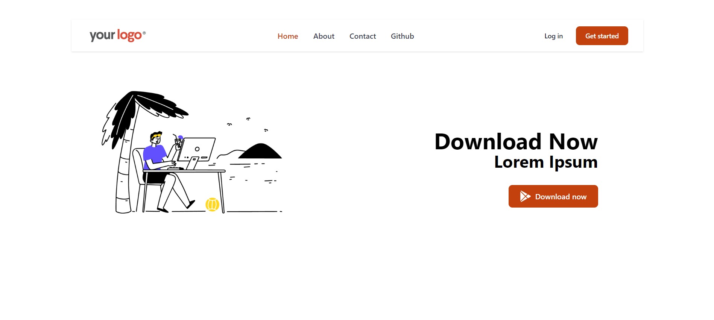

# React Router Project

This project aims to provide a basic understanding of how routes work in React using React Router. By building a simple application with multiple pages and routes, we explore the core concepts of routing in a straightforward manner.

## Purpose of Routes

Routes in web development define the navigation paths within a web application. They allow users to move between different pages or views seamlessly. In React, React Router is a popular library used for handling routing in single-page applications (SPAs). By defining routes, we can map specific URLs to different components, enabling dynamic content rendering based on the URL.

## Project Overview

### Components:

#### 1. Home
- Represents the homepage of the application.
- Contains links to other pages like About, Contact, GitHub and User.

#### 2. About
- Displays information about the project or the application.

#### 3. Contact
- Provides contact information or a contact form.

#### 4. User
- Uses URL parameters to dynamically render user-specific content.

#### 5. Header and Footer
- Common components used to display headers and footers across all pages.

#### 6. Github
- Represents a page to display GitHub-related information.

### Main File (main.jsx)
- Configures routes using React Router.
- Defines routes for different components/pages.
- Utilizes React Router's `createBrowserRouter` and `createRoutesFromElements` for route setup.

## How Routes Work in this Project

1. **Router Configuration:**
   - The main file (`main.jsx`) configures the router using React Router's `createBrowserRouter`.
   - Routes are defined using `Route` components, specifying the path and the component to render for each route.

2. **Component Rendering:**
   - When a user navigates to a specific URL, React Router matches the URL with the defined routes and renders the corresponding component.
   - Components like Home, About, Contact, etc., are rendered based on the matched route.

3. **Dynamic Routing:**
   - The User component demonstrates dynamic routing by utilizing URL parameters (`/user/:userid`). It renders user-specific content based on the provided `userid` parameter.

4. **Navigation:**
   - Navigation between pages is achieved using `Link` components provided by React Router. These links ensure smooth client-side 
   navigation without full-page reloads.

   
# quick look

   

## Conclusion

This project serves as an introductory guide to working with routes in React using React Router. By building a simple application with multiple pages and routes, developers can grasp the fundamental concepts of routing and effectively navigate between different views within a single-page application.
